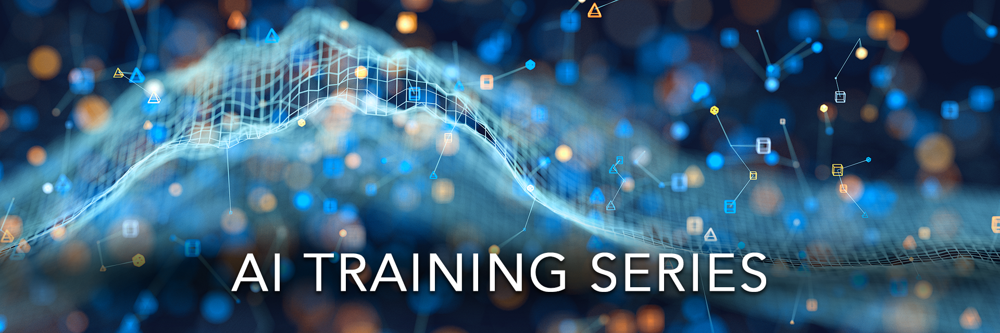

# AI Training Series

    

The OLCF is proud to offer the AI Training Series.
The AI Training Series is meant to highlight workflows, tools, software, and techniques used for machine learning and deep learning in the HPC realm.

This repository contains the tutorials relevant to the various AI Training Series events that have already happened or will happen in the future.

A list of the events (so far):

| Date     | Event                                 | Format | Material |
| :------- | :------------------------------------ | :----- | :------- |
| 04/26/23 | AI for HPC                            | OLCF User Conference Call | [Recording](https://vimeo.com/823104570), [Slides](https://www.olcf.ornl.gov/wp-content/uploads/HPC-AI_Combination_UserMeeting_26Apr2023.pdf) |
| 06/15/23 | [AI for Science at Scale - Introduction](./ai_at_scale) | Tutorial | [Recording](https://vimeo.com/836918490), [Slides](https://www.olcf.ornl.gov/wp-content/uploads/AI-For-Science-at-Scale-Introduction.pdf) |
| 07/13/23 | [SmartSim at OLCF](./smartsim)        | Tutorial | [Recording](https://vimeo.com/845346288), [Slides](https://www.olcf.ornl.gov/wp-content/uploads/20230713_OLCF_SmartSim.pdf), [Q&A](https://www.olcf.ornl.gov/wp-content/uploads/ZoomQA_smartsim.txt), [Tutorial](https://github.com/CrayLabs/OLCF_SmartSim2023) |
| 10/12/23 | [AI for Science at Scale - Part 2](./ai_at_scale_part_2) | Tutorial | [Recording](https://vimeo.com/873844751), [Slides](https://www.olcf.ornl.gov/wp-content/uploads/AIforSciencePart2.pdf) |
