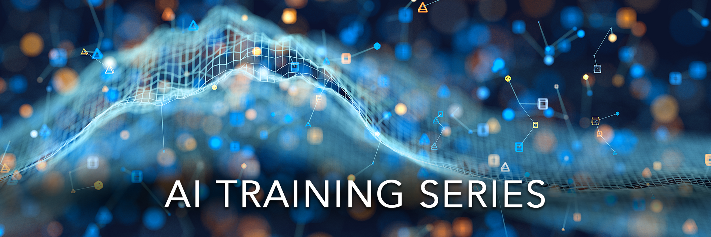

# AI Training Series

    

The OLCF is proud to offer the AI Training Series.
The AI Training Series is meant to highlight workflows, tools, software, and techniques used for machine learning and deep learning in the HPC realm.

This repository contains the tutorials relevant to the various AI Training Series events that have already happened or will happen in the future.

A list of the events (so far):

| Date     | Event                                 | Format | Material |
|:---------| :------------------------------------ | :----- | :------- |
| 04/26/23 | [AI for HPC](https://www.olcf.ornl.gov/calendar/userconcall-apr2023/) | OLCF User Conference Call | [Recording](https://vimeo.com/823104570), [Slides](https://www.olcf.ornl.gov/wp-content/uploads/HPC-AI_Combination_UserMeeting_26Apr2023.pdf) |
| 06/15/23 | [AI for Science at Scale - Introduction](./ai_at_scale) | Tutorial | [Recording](https://vimeo.com/836918490), [Slides](https://www.olcf.ornl.gov/wp-content/uploads/AI-For-Science-at-Scale-Introduction.pdf) |
| 07/13/23 | [SmartSim at OLCF](./smartsim)        | Tutorial | [Recording](https://vimeo.com/845346288), [Slides](https://www.olcf.ornl.gov/wp-content/uploads/20230713_OLCF_SmartSim.pdf), [Q&A](https://www.olcf.ornl.gov/wp-content/uploads/ZoomQA_smartsim.txt), [Tutorial](https://github.com/CrayLabs/OLCF_SmartSim2023) |
| 10/12/23 | [AI for Science at Scale - Part 2](./ai_at_scale_part_2) | Tutorial | [Recording](https://vimeo.com/873844751), [Slides](https://www.olcf.ornl.gov/wp-content/uploads/AIforSciencePart2.pdf) |
| 03/27/24 | [Unlocking the power of LLMs with NVIDIA NeMo](https://www.olcf.ornl.gov/calendar/userconcall-mar2024/) | OLCF User Conference Call | [Recording](https://vimeo.com/928417711), [Slides](https://www.olcf.ornl.gov/wp-content/uploads/NVIDIA_NeMo.pdf) |
| 04/17/24 | [Enhancing PyTorch Performance on Frontier with the RCCL/OFI-plugin](https://www.olcf.ornl.gov/calendar/pytorch-on-frontier/) | Tutorial | [Recording](https://vimeo.com/938233665), [Slides](https://www.olcf.ornl.gov/wp-content/uploads/OLCF_AI_Training_0417_2024.pdf) |
| 07/11/24 | [AI for Science at Scale - Part 3](./ai_at_scale_part_3) | Tutorial | [Recording](https://vimeo.com/983121540), [Slides](https://www.olcf.ornl.gov/wp-content/uploads/AI4S-Tutorial-Part-III.pdf) |
| 09/26/24 | [SmartSim 2024](./smartsim_2024)      | Tutorial | [Recording](https://vimeo.com/1013517492), [Slides](https://www.olcf.ornl.gov/wp-content/uploads/SmartSim_NERSC_OLCF_Workshop2024.pdf), [Tutorial](https://github.com/CrayLabs/smartsim_workshops/tree/nersc_olcf_2024) |
| 01/30/25 | [AI Surrogates for Enhancing Traditional HPC Applications](https://www.olcf.ornl.gov/calendar/ai-surrogates-for-enhancing-traditional-hpc-applications/)      | Tutorial | [Recording](https://vimeo.com/1053501774), [Slides](https://www.olcf.ornl.gov/wp-content/uploads/3680-AI-Surrogates-as-Adjuncts-to-Traditional-HPC-Simulations.pdf) |
| 02/27/25 | [AI surrogate models, interpretability, and uncertainty quantification](https://www.olcf.ornl.gov/calendar/ai-surrogates-for-hpc/)      | Tutorial | [Recording](https://vimeo.com/1061058608) |
| 03/28/25 | [2025 Best Practices for AI on Frontier](https://www.olcf.ornl.gov/calendar/2025-best-practices-for-ai-on-frontier/)      | Tutorial | [Recording](https://vimeo.com/1072282346), [Slides 1](https://www.olcf.ornl.gov/wp-content/uploads/Overview-of-AI-Stack_Yin_032825.pdf), [Slides 2](https://www.olcf.ornl.gov/wp-content/uploads/Best-Practices-Overview_Tsaris_032825.pdf), [Slides 3](https://www.olcf.ornl.gov/wp-content/uploads/Distributed-Training-of-LLMs-on-Frontier_Dash_032825.pdf), [Slides 4](https://www.olcf.ornl.gov/wp-content/uploads/GEMM-User-Tuning-for-AI-Workloads_Fanfarillo_032825.pdf) |
| 07/15/26 | [Contemporary Generative AI and Agentic Workflows](https://www.olcf.ornl.gov/calendar/contemporary-generative-ai-and-agentic-workflows/)   | Tutorial  | Recording, Slides |

