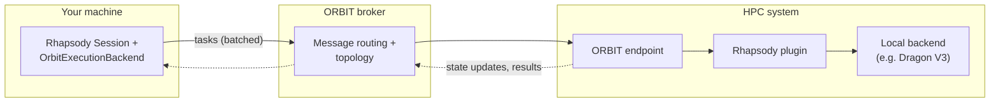

# Configuration

RHAPSODY uses a flexible configuration system for its session and backends.

## Session Configuration

The `Session` object is primarily configured through its constructor:

| Parameter | Type | Default | Description |
|-----------|------|---------|-------------|
| `backends` | `list` | `None` | List of initialized backend objects. |
| `uid` | `str` | `None` | Unique ID for the session (generated if None). |
| `work_dir` | `str` | `None` | Working directory for task files (defaults to CWD). |

## Backend Configuration

Each backend has its own set of parameters.

### Concurrent Backend
Local execution using Python's `concurrent.futures`.

```python
from concurrent.futures import ThreadPoolExecutor
from rhapsody.backends import ConcurrentExecutionBackend

# Default uses ThreadPoolExecutor
backend = ConcurrentExecutionBackend(name="local")

# Or provide a custom executor
executor = ThreadPoolExecutor(max_workers=8)
backend = ConcurrentExecutionBackend(name="local", executor=executor)
```

### Dask Backend
Distributed execution using any Dask-compatible cluster.

```python
DaskExecutionBackend(
    resources={"n_workers": 4, "memory_limit": "2GB"},  # passed to LocalCluster when no cluster/client given
    cluster=pre_existing_cluster_obj,  # SLURMCluster, KubeCluster, LocalCluster, …
    client=pre_existing_client_obj     # pre-existing dask.distributed.Client
)
```

Supports **sync functions**, **async functions**, and **executable tasks**. Pass Dask-specific scheduling hints via `task_backend_specific_kwargs`:

```python
ComputeTask(
    function=my_fn, args=(x,),
    task_backend_specific_kwargs={"resources": {"GPU": 1}},  # GPU worker only
)
ComputeTask(
    executable="/bin/sim", arguments=["--n", "4"],
    task_backend_specific_kwargs={"resources": {"CPU": 4}, "shell": True},
)
```

!!! tip "Preconfigured Clusters"
    If both `cluster` and `client` are omitted, Rhapsody creates a new `LocalCluster` using the provided `resources`. Pass `cluster=` to use SLURM, Kubernetes, or any other Dask cluster type.

### Dragon Backend
High-performance execution using the Dragon runtime.

```python
from rhapsody.backends import DragonExecutionBackend

backend = DragonExecutionBackend(
    name="dragon",
    num_nodes=4,            # Total nodes for the worker pool (optional)
    pool_nodes=2,           # Nodes per worker pool (optional)
    disable_telemetry=False,  # Enable/disable Dragon telemetry
)
```

| Parameter | Type | Default | Description |
|-----------|------|---------|-------------|
| `name` | `str` | `"dragon"` | Backend identifier used for task routing |
| `num_nodes` | `int` | `None` | Total number of nodes; forwarded to `Batch(num_nodes=...)` |
| `pool_nodes` | `int` | `None` | Nodes per worker pool; forwarded to `Batch(pool_nodes=...)` |
| `disable_telemetry` | `bool` | `False` | Disable Dragon internal telemetry |

!!! note "Streaming pipeline"
    `DragonExecutionBackend` uses Dragon's streaming batch pipeline — tasks submitted via
    `session.submit_tasks()` are dispatched individually by a continuously running background
    thread. There is no compile or start step; tasks begin executing as soon as they are submitted.

!!! note "Dragon Versions"
    `DragonExecutionBackend` is the only supported Dragon backend as of RHAPSODY 0.5.0.

### Orbit Backend
Remote execution on an HPC system through the ORBIT broker/endpoint infrastructure.

[ORBIT](https://github.com/radical-cybertools/radical.orbit) is a lightweight
communication fabric for reaching compute resources that are not directly
accessible from where your application runs (e.g. behind an HPC login node or
firewall). Both your application and the remote resource connect *outbound* to
a shared **broker**, which routes messages between them. On the remote side, an
**endpoint** process runs on the HPC system and exposes plugins — one of which
is a Rhapsody plugin hosting a local execution backend (Dragon V3 by default)
that actually runs your tasks. The `OrbitExecutionBackend` connects to the
broker, discovers a suitable endpoint from the live topology, and from then on
behaves like any other Rhapsody backend: tasks submitted to the local session
are batched, shipped to the remote endpoint, executed there, and their results
and state updates streamed back via notifications.



```python
from rhapsody.backends import OrbitExecutionBackend

backend = await OrbitExecutionBackend(
    broker_url="https://broker.example.org:8000",
    endpoint_name="frontier_ep",   # optional — auto-selected if omitted
    backends=["dragon_v3"],        # backend(s) to run on the remote endpoint
)
```

| Parameter | Type | Default | Description |
|-----------|------|---------|-------------|
| `broker_url` | `str` | `None` | ORBIT broker URL; falls back to `RADICAL_ORBIT_BROKER_URL` or `~/.radical/orbit/broker.url` |
| `endpoint_name` | `str` | `None` | Endpoint to target; auto-selects the first live endpoint advertising a Rhapsody plugin if omitted |
| `backends` | `list` | `["dragon_v3"]` | Backend names to start in the remote session |
| `name` | `str` | `"orbit"` | Backend identifier used for task routing |
| `batch_window` | `float` | `0.25` | Seconds to collect tasks before flushing as one bulk request; `0` disables batching |
| `batch_limit` | `int` | `1024` | Max tasks per batch — triggers an immediate flush when reached |
| `start_timeout` | `float` | `30` | Seconds to wait for broker registration |
| `init_timeout` | `float` | `120` | Seconds to wait for the remote session to become ready |

The broker bearer token is resolved the same way as the URL, from
`RADICAL_ORBIT_BROKER_TOKEN` or `~/.radical/orbit/broker.token`.

!!! note "Submission batching"
    Tasks submitted individually are collected over a short time window and
    flushed as a single bulk request, which drastically reduces per-task
    round-trip overhead. Bulk submissions and transport-level optimizations
    (template compression, pipelined batching, event-based waiting) are
    inherited from the ORBIT client.

!!! warning "Function tasks require matching Python versions"
    Function tasks are shipped with `cloudpickle`, which is not portable
    across Python *minor* versions — the client and the remote endpoint must
    run the same `major.minor` Python (the backend checks this and fails
    fast on a mismatch). Executable and import-path tasks are unaffected.
    The `orbit` extra itself requires Python >= 3.10.

### RADICAL-Pilot Backend
Large-scale HPC execution using RADICAL-Pilot.

```python
RadicalExecutionBackend(
    resources={
        "resource": "local.localhost",
        "runtime": 30, # minutes
        "cores": 128
    }
)
```

## Environment Variables

RHAPSODY respects the following environment variables:

- `RHAPSODY_LOG_LEVEL`: Set to `DEBUG`, `INFO`, `WARNING`, `ERROR`, or `CRITICAL`.
- `RHAPSODY_WORK_DIR`: Base directory for job artifacts.

!!! note "Logging"
    You can also enable logging programmatically:
    ```python
    from rhapsody import enable_logging
    enable_logging(level="DEBUG")
    ```
